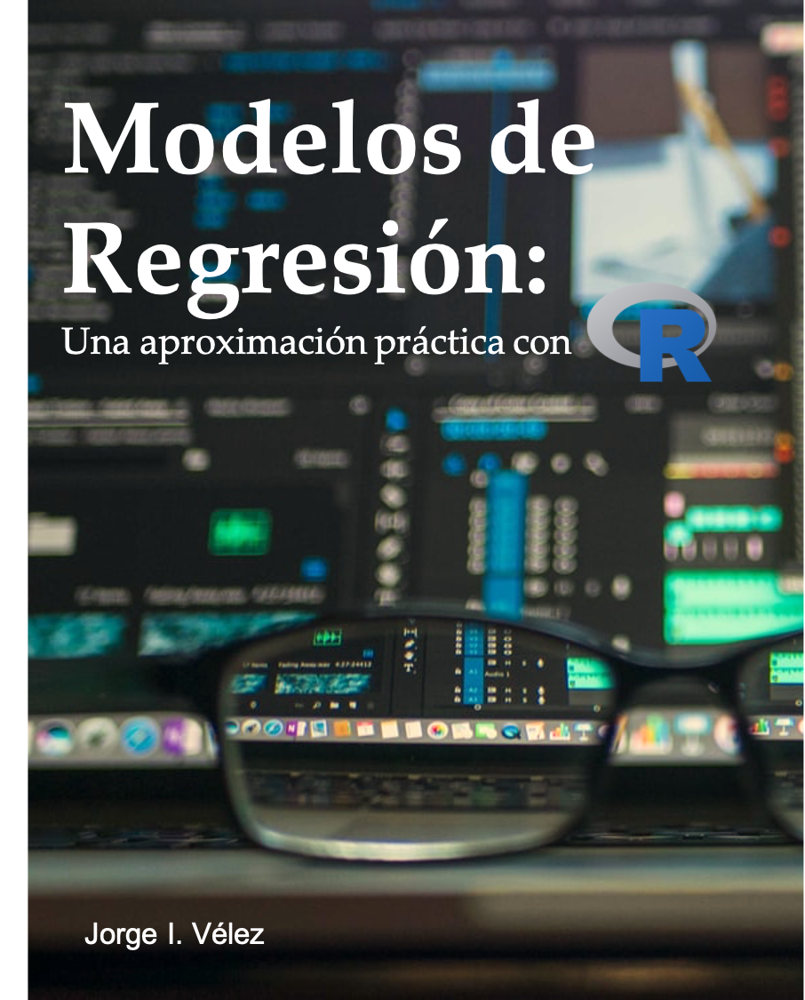

<hr>
<br>

:::::::::::::: {.columns}
::: {.column width="50%"}

I am currently preparing the textbook [_Modelos de Regresión: Una aproximación práctica con R_](https://jivelez.github.io/book-adii/), which covers most of the topics discussed in the course [Data Analysis in Engineering II](https://jivelez.github.io/teaching.html).  

Comments, suggestions and recommendations are more than welcome. 


:::
::: {.column width="50%"}

```{r book, echo=FALSE, out.width="60%", fig.align='center'}

```

:::
::::::::::::::


<center>
<br><br><br>
<hr>
Copyright ® 2021, webpage made with [Rmarkdown](https://rmarkdown.rstudio.com/).
<hr>
</center>
